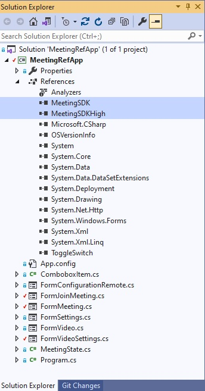

# Getting Started for Windows Platforms #

## The Meeting SDK Distribution ##

To obtain the Meeting SDK for Windows, use the [Downloads](https://github.com/visionable-public/WindowsMeetingSDK "Downloads") link to access the GitHub repository holding the Meeting SDK.

## Adding the Meeting SDK to your Visual Studio Project ##

- Create a new Visual Studio "Windows Forms App" or "WPF App" Project.

- Right click on the "References" and select "Add Reference". Then click browse and locate the MeetingSDK.dll and MeetingSDKHigh.dll.



- Add the Meeting SDK Namespace by adding the following statement to your C# files which will be using the Meeting SDK.

```C#
using MeetingSDKHigh; // Meeting SDK (High Level)
```

- You now have access to the Meeting Application Programming Interface (API's).

- For details on the Meeting Application Programming Interface (API's), please refer to the windows-reference-application document provided.

